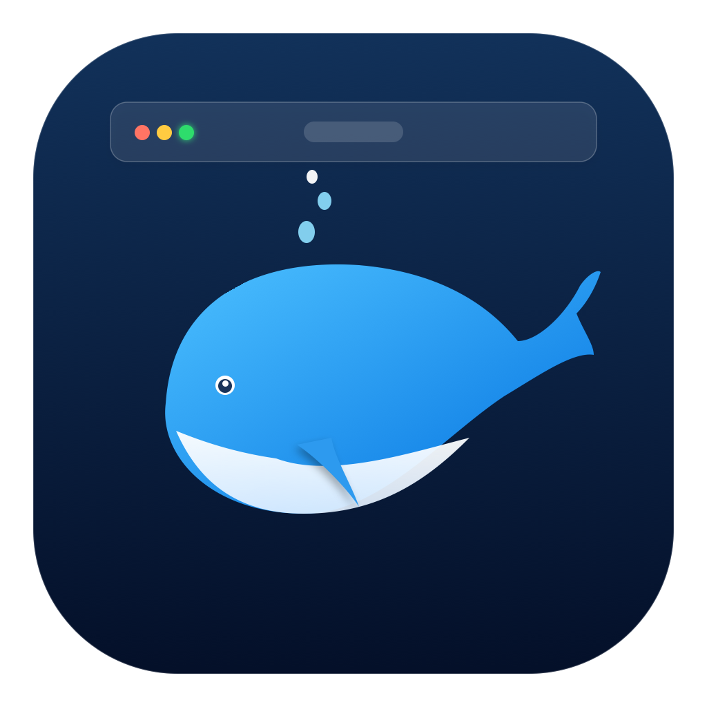

# DSH Bar (macOS) 🐳

<p align="center">
  
</p>

<p align="center">
  <b>A native macOS menu bar companion for DeepSeek Harness.</b><br>
  专为 DeepSeek Harness 打造的原生 macOS 菜单栏助手：查看运行状态、一键启停、直达 Web 界面。
</p>

---

## 💡 为什么用 DSH Bar？ / Why DSH Bar?

如果你平时用 `dsh web` 启动 DeepSeek Harness，那么“服务在不在跑”“怎么停掉后台进程”“换端口后怎么重启”这些事，通常都得回到终端敲 `lsof`、`kill`。DSH Bar 把这些操作放进菜单栏，随手一点即可。

- **纯原生 Swift**：无第三方依赖，发布包同时支持 Apple Silicon 与 Intel，不占用 Dock 位置。
- **状态一眼可见**：菜单栏状态灯区分检查中、启动中、运行中、端口冲突与错误，并显示 PID、运行时长和 DSH 版本。
- **可自定义**：端口、打开 Web 的全局热键与开机自启动；应用和服务启动/重启时都不会自动打开网页。
- **只停自己的服务**：停止时只结束由本应用启动的 `dsh` 进程，不会误杀占用同一端口的浏览器或其他程序。

---

## ⚡️ 前置条件 / Prerequisites

> **本应用是 DeepSeek Harness 的伴侣工具，需要官方 `dsh` 命令行。**

DSH Bar 会通过 `which dsh` 自动检测安装路径并读取版本。如果没有找到，会在设置界面显示 **Install…**，复制官方 npm 安装命令并打开终端协助安装：

```bash
npm install -g @deepseek-ai/dsh
```

- **操作系统**：macOS 13.0 (Ventura) 及以上，支持 Apple Silicon 与 Intel。

---

## 🚨 常见问题：提示“应用已损坏，无法打开”？ / Troubleshooting

本项目没有使用 Apple Developer Program 的签名与公证证书，所以从 GitHub 下载后，macOS 的 Gatekeeper 可能提示：

> **“DSH Bar 已损坏，无法打开。你应该将它移到废纸篓”** 或 **“无法打开，因为无法验证开发者”**

**解决方法**：在终端里解除隔离属性。

```bash
sudo xattr -rd com.apple.quarantine "/Applications/DSH Bar.app"
```
*（输入密码时不会显示字符，直接回车即可）*

或者：

```bash
xattr -cr "/Applications/DSH Bar.app"
```

执行后即可正常启动。

> 💡 **图形界面方法**：打开「系统设置」→「隐私与安全性」，滑到底部会看到“已阻止使用 DSH Bar”，点击 **“仍要打开”**。

---

## ✨ 核心特性 / Features

- 🐳 **菜单栏常驻**：系统原生 `🐳` Emoji，自适应深浅色，不占用 Dock。
- 🟢 **详细服务状态**：菜单栏与设置页显示检查中、启动中、运行中、停止中、重启中、端口冲突和错误，并提供 PID、运行时长及已安装 DSH 版本。
- 🔌 **自定义端口**：默认 3080。运行中修改端口会保留旧监听，重启前先检查新端口，避免误停或遗留服务。
- 🚀 **安静启停 / 重启**：始终使用 `dsh web --no-open` 在后台启动；Start 和 Restart 不会拉起浏览器。
- 🔐 **只管理自己的服务**：启动时把 `{PID, 端口, 启动时间}` 记录到 `~/.dsh/dsh-bar-service.json`。停止前会校验进程启动时间是否匹配，PID 被复用时拒绝操作；不是本应用启动的 Harness 只显示状态，不会去停止或重启它。
- 🌐 **显式打开 Web**：只有点击 Open Web 或使用其全局热键时才打开浏览器，并使用本次启动捕获的认证 URL（token 只留在内存中）。
- 📜 **内置实时日志**：直接在应用中跟踪 `~/.dsh/logs/dsh-web.log`，支持暂停、搜索、清空当前视图和在 Finder 中定位；显示时会自动隐藏 URL 中的进程 token。
- 🔎 **DSH 自动检测**：通过 `which dsh` 检测路径和版本，未安装时提供 npm 安装引导。
- 🪟 **偏好设置面板（`⌘,`）**：
  - **端口**：修改并一键恢复默认（服务启停/重启期间会锁定，避免端口错配）。
  - **全局热键**：录制自定义全局热键，录完立即生效。
  - **开机自启动**（Launch at login）。
  - 检查 DSH CLI 路径和版本，并在缺失时提供安装引导。
  - 复制本地 Web 地址、打开内置实时日志。
  - 启动或重启 DSH Bar、启动或重启服务时都不会自动打开 Web 界面。

---

## ⌨️ 快捷键速查 / Shortcuts

### 全局热键（任何软件处于前台时都有效）
| 快捷键 | 动作 | 说明 |
| :--- | :--- | :--- |
| **`⌥ + ⇧ + D`**<br>*(可在设置中修改)* | 打开 DSH Web | 服务未启动则先在后台拉起，再打开浏览器；已在运行则直接打开 |

> 已移除原来的 `⌥ + ⇧ + H` 设置面板全局快捷键；设置仍可从菜单栏或 `⌘,` 打开。

### 菜单栏 / 面板内快捷键
| 快捷键 | 动作 |
| :--- | :--- |
| **`⌘ + ,`** | 打开偏好设置面板 |
| **`⌘ + O`** | 在默认浏览器中打开 Web 控制台 |
| **`⌘ + S`** | 启动 / 停止后台服务 |
| **`⌘ + R`** | 重启服务 |
| **`⇧ + ⌘ + C`** | 复制 Web 地址 (`http://127.0.0.1:<port>`) |
| **`⌘ + L`** | 查看实时运行日志 |
| **`Esc` / `⌘ + W`** | 关闭面板（应用仍在菜单栏常驻） |
| **`⌘ + Q`** | 退出 DSH Bar |

---

## 🛠 安装与构建 / Installation & Build

### 方式一：下载 GitHub Release（推荐）

每个 `v*` 标签都会由 GitHub Actions 自动构建同时支持 Apple Silicon 和 Intel 的通用应用，并在 Release 中生成（`0.x` 版本会标记为 Pre-release）：

- `DSH-Bar-<version>-universal.zip`
- 对应的 `.sha256` 校验文件

发布包的签名取决于仓库是否配置了 Developer ID secrets：

| 配置 | 结果 |
| :--- | :--- |
| 已配置 `APPLE_CERT_P12_BASE64`、`APPLE_CERT_PASSWORD`、`APPLE_ID`、`APPLE_TEAM_ID`、`APPLE_APP_PASSWORD` | Developer ID 签名 + 硬化运行时 + 公证 + stapler，Gatekeeper 可直接打开 |
| 未配置 | 仅 ad-hoc 签名，Release 说明会明确提示需要手动执行 `xattr -cr` |

发布前可在本地复现同样的产物：

```bash
VERSION=0.0.2 ./build.sh          # 通用二进制 + ad-hoc 签名
VERSION=0.0.2 SIGNING_IDENTITY="Developer ID Application: …" ./build.sh
```

### 方式二：从源码编译并安装

```bash
git clone https://github.com/donald-trump86/dsh-bar-macos.git
cd dsh-bar-macos
make install
open -a "DSH Bar"
```

### 方式三：只编译，不安装

```bash
make
open "build/DSH Bar.app"
```

---

## 📂 项目结构 / Project Structure

```text
dsh-bar-macos/
├── Sources/
│   ├── main.swift              # 程序入口
│   ├── AppDelegate.swift       # 菜单栏图标（🐳 + 状态点）、菜单与状态控制
│   ├── ServiceManager.swift    # 详细状态、身份检测、安静启停、PID 与 DSH 检测
│   ├── HotKeyManager.swift     # “打开 Web”可配置全局热键
│   ├── SettingsManager.swift   # 端口、开机启动 (SMAppService)、热键持久化
│   ├── DashboardWindow.swift   # 毛玻璃偏好设置面板
│   ├── LogWindow.swift         # 内置实时日志窗口
│   └── DshInstallAssistant.swift # DSH/npm 安装引导
├── Resources/
│   ├── AppIcon.icns            # 应用图标 (1024x1024)
│   └── icon.png                # README 与面板使用的图标
├── Packaging/
│   └── DSHBar.entitlements     # Developer ID 签名使用的 hardened runtime 配置
├── Info.plist                  # Bundle 配置（LSUIElement，仅菜单栏）
├── .github/workflows/release.yml # 标签触发的通用应用构建与 Release 发布
├── build.sh                    # macOS 13+ 通用二进制编译、签名与打包脚本
├── Makefile                    # make build / install / run / clean
├── LICENSE                     # MIT
└── README.md                   # 项目说明
```

---

## 📄 开源许可证 / License

本项目基于 [MIT License](LICENSE) 开源。
欢迎提 Issue 或 PR。
